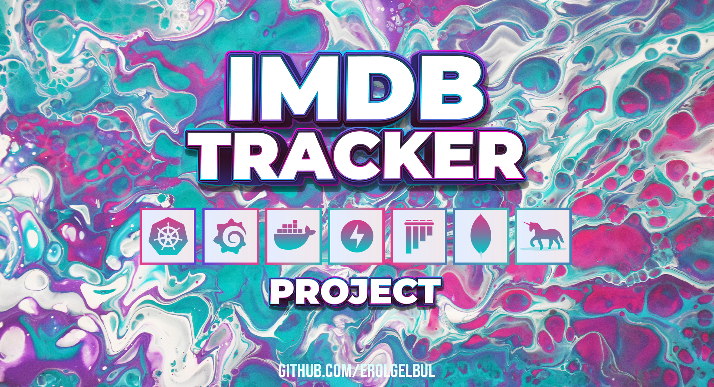

  

<!-- ABOUT THE PROJECT -->
## 1. Introduction

Movie Tracking API

## 2. Stack

### 2.1 Back-end:

- FastAPI
- MongoDB

### 2.2 Testing Framework:

- Pytest

### 2.3 DevOps

- Kubernetes
- Docker
- Grafana
- Gunicorn

## 3. API Endpoints

1. POST /api/v1/movies/

    * Description: Creates a movie.
    * Request Body: CreateMovieBody object (with fields title, description, release_year, and optional watched)
    * Response Model: MovieCreatedResponse

2. GET /api/v1/movies/{movie_id}

    * Description: Returns a Movie if found, None otherwise.
    * Path Parameter: movie_id (string, required)
    * Response Model: MovieResponse (200) or DetailResponse (404)

3. GET /api/v1/movies/

    * Description: Returns movies by filtering their title.
    * Query Parameter: title (string, required, minimum length 3)
    * Pagination Parameters: skip (integer, optional, default 0), limit (integer, optional, default 1000)
    * Response Model: List of MovieResponse objects

4. PATCH /api/v1/movies/{movie_id}

    * Description: Updates a movie.
    * Path Parameter: movie_id (string, required)
    * Request Body: MovieUpdateBody object (with optional fields title, description, release_year, and watched)
    * Response Model: DetailResponse (200) or DetailResponse (400)

5. DELETE /api/v1/movies/{movie_id}

    * Description: Deletes a movie.
    * Path Parameter: movie_id (string, required)
    * Response: 204 No Content

<!-- CONTACT -->
## 4. Contact

Erol Gelbul - [Website](erolgelbul.com)

Project Link: [IMBD Tracker](https://github.com/ErolGelbul/imdb_tracker)

(<a href="#top">back to top</a>)
